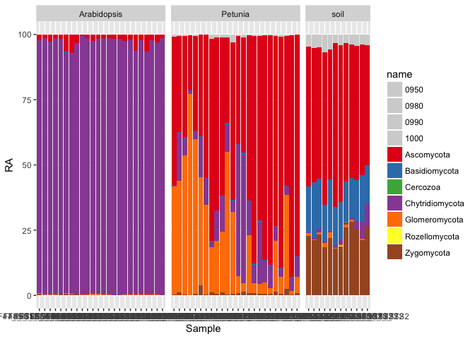

Abstract
--------

In this study, we investigate the interplay between bacteria and fungi that are associated with the roots of Petunia plants as a function of the P availability in soil. Additionally, we examine Arabidopsis plants, which secrete minute amounts of strigolactones and which are not colonized by AMF. Finally, we included soil samples to control for the effect of P levels on the microbial community in the absence of plants. The goals of this study are to understand the dynamics of the root microbiome in response to the P availability in soil and to clarify the role of strigolactones as signaling molecules in this process.

Method
------

Petunia and Arabidopsis were grown in pots filled with Soil from next to the FAST trial. Pots were watered with a P gradient: low, medium and high. Plants were harvested after 10 weeks. Two fractions for each sample were harvested: 1) the roots were washed three times with phosphate buffer and dried on filter paper, this fraction is called the 'root' community; 2) the three washes of each sample were pooled and centrifuged, the pellet is called the 'rhizosphere'. The roots and the rhizosphere samples were stored at -80C until DNA extraction. For this data set, only the root-associated community was analyzed. In addtion, soil from unplanetd pot was also collected. Together, there were 108 samples (72 Petunia samples, 24 Arabidopsis samples and 12 soil samples).

DNA was extracted from the roots by Natacha with NucleoSpin Soil kit from Macherey-Nage. For the bacterial community, a fragment of the 16S rRNA gene was amplifed with primers 799F and 1193R. For the fungal community, a fragment of the intergenic spacer region 1 was amplified with primers ITS1F and ITS2 which were found in a previous comparison to perform better than other primers pairs (higher richness, little contamination with plant DNA, high percentage of Glomeraceae) . Alain prepared the fungal library and Natacha prepared the bacterial library. After clean-up, the PCR products were pooled in equimolar concentrations and sequenced at the Functional Genomics Center in Zurich with MiSeq.

\newpage
MySeq (16S) loading data from bioinformatic analysis
----------------------------------------------------

MySeq (ITS) loading data from bioinformatic analysis
----------------------------------------------------

### Prepare sample table for 16S

    ##              
    ##               low medium high
    ##   Arabidopsis   8      7    9
    ##   W115         10     10   10
    ##   Petunia       8      8    9
    ##   dad1          5      6    6
    ##   soil          4      4    4

### Prepare sample table for ITS

    ##              
    ##               low medium high
    ##   Arabidopsis   8      7    9
    ##   W115         10     10   10
    ##   Petunia       8      8    9
    ##   dad1          5      6    6
    ##   soil          4      4    4

### remove W115 and dad1 from 16S

### remove W115 and dad1 from ITS

treatment colours
-----------------

    ## quartz_off_screen 
    ##                 2

    ## quartz_off_screen 
    ##                 2

\newpage
Barplot at the phylum or Family level (each sample own barplot)
---------------------------------------------------------------

I asked Kyle for his code than adapted it to my data.

\newpage
Trying with ggplot =&gt; still needs to be improved to be publiation ready
--------------------------------------------------------------------------

